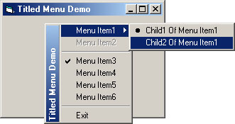

<div align="center">

## Titled PopupMenu


</div>

### Description

This turned out to be more difficult to work out than the drawing of a button on the titlebar.

Of course once I'd got it it was simple.

Once again this code uses subclassing so always use the forms close button or the menus exit to stop the project, or you will crash.
 
### More Info
 


<span>             |<span>
---                |---
**Submitted On**   |2001-06-02 17:08:58
**By**             |[Mick Doherty](https://github.com/Planet-Source-Code/PSCIndex/blob/master/ByAuthor/mick-doherty.md)
**Level**          |Intermediate
**User Rating**    |4.8 (230 globes from 48 users)
**Compatibility**  |VB 5\.0
**Category**       |[Custom Controls/ Forms/  Menus](https://github.com/Planet-Source-Code/PSCIndex/blob/master/ByCategory/custom-controls-forms-menus__1-4.md)
**World**          |[Visual Basic](https://github.com/Planet-Source-Code/PSCIndex/blob/master/ByWorld/visual-basic.md)
**Archive File**   |[Titled Pop20445622001\.zip](https://github.com/Planet-Source-Code/mick-doherty-titled-popupmenu__1-23712/archive/master.zip)

### API Declarations

```
CreatePopupMenu
TrackPopupMenu
AppendMenu
ModifyMenu
DestroyMenu
GetCursorPos
CopyMemory
BitBlt
SetRect
DrawCaption
GetMenuItemRect
GetMenuItemCount
GetPixel
SetPixel
CallWindowProc
SetWindowLong
```


